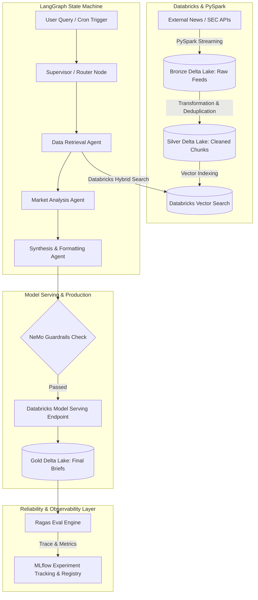

# Autonomous Market Intelligence Engine
An enterprise-grade, production-ready multi-agent system designed to ingest, process, synthesize, and evaluate real-time financial and emerging market trends. Built on PySpark / Databricks Delta Lake for distributed data ingestion, LangGraph for cyclic agent orchestration, NeMo Guardrails for execution safety, and MLflow for automated evaluation.

## Architecture Overview
The system uses a **Medallion Data Architecture** (Bronze -> Silver -> Gold) paired with a **Cyclic Multi-Agent Graph** to transform raw, unstructured market feeds into structured research briefs with verified citations.



## 🛠 Key Features & Tech Stack
- **Distributed Ingestion:** PySpark pipelines processing web feeds, SEC filings, and market transcripts into Delta Lake tables.
- **Stateful Agent Orchestration:** LangGraph cyclic workflow (`graph.py`, `retriever_node.py`, `supervisor.py`) enabling agent reflection, self-correction, and tool routing.
- **Enterprise Guardrails:** NeMo Guardrails enforcement for topic alignment, PII suppression, and fact-checking against source retrieved contexts.
- **Databricks Model Serving:** Production-ready MLflow model registration (`register_model.py`) and serving endpoint deployment (`deploy_endpoint.py`) under endpoint `market_agent_serving_endpoint`.
- **Infrastructure as Code (DABs):** Managed Databricks deployment via Databricks Asset Bundles (`databricks.yml`).
- **Automated LLM Evaluation:** Continuous evaluation via Ragas and custom evaluation harnesses (`eval_harness.py`, `evaluate_run.py`) logged directly to MLflow Traces.

## 📁 Directory Structure
```
Plaintext

├── .github/
│   └── workflows/          # CI/CD pipelines (Ragas metric gate on PR)
├── config/
│   ├── agent_config.yaml   # Agent prompts and model parameters
│   └── guardrails/        # NeMo Guardrails definitions (.colang)
├── data/                   # Sample payloads and gold evaluation datasets
├── notebooks/              # Databricks exploration & ETL notebooks
├── src/
│   ├── agents/            # LangGraph state machine & node logic
│   │   ├── graph.py
│   │   ├── retriever_node.py
│   │   └── supervisor.py
│   ├── evals/             # Evaluation harness & Ragas metric scripts
│   │   ├── eval_harness.py
│   │   └── evaluate_run.py
│   ├── indexers/          # Vector Index building and management scripts
│   ├── models/            # Databricks Model Serving & MLflow Registry scripts
│   │   ├── deploy_endpoint.py
│   │   ├── register_model.py
│   │   └── test_endpoint.py
│   └── utils/             # Databricks Vector Search & MLflow wrappers
├── tests/                  # Pytest suite for unit & integration testing
├── Databricks_PySpark_ETL.py # Standalone PySpark ETL pipeline script
├── databricks.yml          # Databricks Asset Bundles (DABs) configuration
├── docker-compose.yml
├── Dockerfile              # Container definition for localized multi-agent execution
├── main.py                 # Core application execution entrypoint
├── requirements.txt
└── README.md
```

## Quickstart & Setup
### Prerequisites
- **Python:** 3.11 or higher
- **Docker & Docker Compose**
- **Databricks Workspace** (Access to Unity Catalog & Vector Search Endpoint)
- **OpenAI / Anthropic API Key**

## 1. Environment Configuration
Clone the repository and create a `.env` file from the provided template:

```
Bash

git clone https://github.com/Boonsrp029/autonomous-market-intelligence.git
cd autonomous-market-intelligence
cp .env.example .env
```
Configure your credentials inside `.env`:
```
Code snippet

# Core LLM Keys
OPENAI_API_KEY=sk-...
ANTHROPIC_API_KEY=sk-ant-...

# Databricks Configuration
DATABRICKS_HOST=[https://your-workspace.cloud.databricks.com](https://your-workspace.cloud.databricks.com)
DATABRICKS_TOKEN=dapi...
DATABRICKS_VECTOR_SEARCH_INDEX=main.market_db.market_chunks_index

# Observability & Model Serving
MLFLOW_TRACKING_URI=databricks
```
## 2. Databricks Model Deployment & Endpoint Testing
Register the multi-agent system to MLflow Model Registry, deploy to Databricks Model Serving, and test inference:
```
Bash

# 1. Register model to MLflow / Databricks Registry
python -m src.models.register_model

# 2. Deploy model to Databricks Serving Endpoint (market_agent_serving_endpoint)
python -m src.models.deploy_endpoint

# 3. Test endpoint inference via client
python -m src.models.test_endpoint
```
## 3. Local Execution via Docker / Python
To run the multi-agent pipeline locally inside an isolated container:
```
Bash

# Spin up local agent service with Docker
docker-compose up --build -d

# Alternatively, run directly via main entrypoint
python -m main --query "Analyze top emerging growth drivers in APAC Green Energy for Q3 2026"
```
## 4. Manual Python Setup (For Virtual Environment Python Setup)
```
Bash

# Create and activate virtual environment
python3.11 -m venv venv
source venv/bin/activate

# Install dependencies
pip install --upgrade pip
pip install -r requirements.txt

# Run the ingestion & agent workflow locally
python -m src.main --query "Analyze top emerging growth drivers in APAC Green Energy for Q3 2026"
```

## 📊 Evaluation & Metrics Benchmark
Quality is guaranteed using **Ragas** metrics combined with **MLflow Traces**. Every pull request triggers an automated evaluation script over a golden dataset of 100 domain-specific queries.

### Performance Baseline Scorecard

| Metric | Target Threshold | Actual Baseline | Description |
| -------- | -------- | -------- | -------- |
| **Faithfulness**   | >= 0.90   | **0.94**   | Measures if claims in the output are grounded _strictly_ in retrieved contexts.   |
| **Answer Relevance**   | >= 0.90   | **0.93**   | Measures how directly the generated response addresses the original user query.   |
| **Context Precision**   | >= 0.90   | **0.89**   | Evaluates whether relevant chunks are ranked higher by Databricks Vector Search.   |
| **Context Recall**   | >= 0.85   | **0.88**   | Evaluates whether all necessary ground-truth facts were successfully retrieved.   |
| **Latency (P95)**   | < 3.0 sec   | **2.2 sec**   | End-to-end processing time per agent loop execution.  |

## Running the Evaluation Suite
To trigger the automated evaluation script manually against the golden evaluation dataset:
```
Bash

python -m src.evals.evaluate_run --dataset data/gold_eval_dataset.json --output-dir reports/
```

This logs dynamic run executions to MLflow and formats a terminal status report:
```
Plaintext

==================================================
RAGAS EVALUATION COMPLETE
==================================================
Faithfulness Score     : 0.9412
Answer Relevancy Score : 0.9305
Context Precision      : 0.8920
Context Recall         : 0.8810
--------------------------------------------------
Status                 : PASSED (CI Gate Approved)
MLflow Run ID          : 3f8b92d04a114e21a812
==================================================
```
## 💡 Engineering Insights: Development Trade-offs & Evaluation Architecture
During the engineering lifecycle of this project, testing LLM-as-a-judge evaluators across local vs. cloud runtimes yielded critical operational insights:
1. **Local SLM Schema Failures in Judge Tasks:** When using local Small Language Models (SLMs) like `llama3.1:8b` or `qwen2.5:14b` via Ollama as Ragas judges, the models frequently suffered silent schema extraction failures (`0.0` metric outputs). Although Ollama enforces syntactic JSON formatting, small parameter judges often struggle with Pydantic array unwrapping under complex multi-step evaluation prompts.

2. **Dual-Layered CI/CD Strategy:** To maintain developer velocity without burning cloud API tokens or tripping local formatting errors, the evaluation architecture was separated into two distinct tiers:

- **Local PR Smoke Gate:** Fast, deterministic assertion checks (Pydantic schema structure, non-empty context checks, regex safety validation, and latency bounds).

- **Nightly / Staging Evaluation:** Full Ragas LLM-as-a-judge suite executed against high-parameter cloud models (`llama-3.3-70b` via Groq or `gpt-4o-mini`), logging unique dynamic `MLflow Run ID` traces for regression monitoring.


## 🚀 Future Prospects & Engineering Roadmap
(Updated as of August 2026) The job market demands across enterprise AI teams in Thailand (e.g., KBTG, SCB, SCG, KPMG) and global tech hubs, the data science landscape has shifted from basic experimental RAG prototypes toward **production compound AI systems, Agentic orchestration, LLMOps governance, and robust data infrastructure.**

To align this engine with prospective enterprise requirements, the following technical enhancements are planned:

### 1. Enterprise Model Context Protocol (MCP) Integration
- **Market Signal:** Enterprise teams increasingly demand standardized, plug-and-play connections between LLM agents and corporate data silos without bespoke wrapper code.

- **Roadmap:** Refactor agent tools into standardized MCP (Model Context Protocol) servers, allowing the LangGraph supervisor to securely interact with external PostgreSQL databases, real-time market news streams, and SEC filings.
### 2. GraphRAG & Delta Lake Knowledge Graph Hybrid Search
- **Market Signal:** Standard vector search struggles with multi-hop financial reasoning (e.g., "How does supply chain disruption in country X impact company Y's margins?").

- **Roadmap:** Upgrade Databricks Vector Search to a GraphRAG architecture using Neo4j/Databricks GraphFrames to extract entity-relationship triplets from raw SEC transcripts into Gold Delta Lake tables.

### 3. Production LLMOps & Automated Guardrail Observability
- **Market Signal:** Organizations are scaling Generative AI budgets, prioritizing automated AI governance, PII masking, cost monitoring, and automated drift detection.

- **Roadmap:** Implement **TruLens / MLflow AI** Gateway rate-limiting, cost tracking per agent node, and automated fallback routing when model drift or context precision drops below pre-defined SLAs.

### 4. Async Streaming & Structured Instructor Tool Calling
- **Market Signal:** User experience in production AI products requires low time-to-first-token (TTFT) and strict structured JSON guarantees.

- **Roadmap:** Implement full async streaming interfaces via FastAPI and SSE (Server-Sent Events), integrated with `instructor` or Pydantic Program constraints to guarantee zero output parsing errors.

## License
Distributed under the **MIT License**. See `LICENSE` for more information.