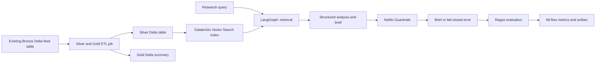

# Autonomous Market Intelligence Engine

AMI Engine is an experimental, production-oriented portfolio project for evidence-grounded market research. Its current implementation has one LangGraph runtime, Databricks Vector Search retrieval, structured LLM output, a fail-closed NeMo Guardrails check, a Bronze-to-Silver/Gold Databricks job, and Ragas evaluation recorded in MLflow.

“Production-oriented” describes the engineering direction and safeguards in code. This repository has **not** been qualified as production-ready: the configured Databricks token was rejected during this review, so a live end-to-end run and external deployment could not be verified. Do not use it for business-critical decisions until your workspace deployment, security, recovery, monitoring, and evaluation controls pass the operational checklist below.

## Architecture


```mermaid
flowchart LR
  A[Existing Bronze Delta feed table] --> B[Silver and Gold ETL job]
  B --> C[Silver Delta table]
  C --> D[Databricks Vector Search index]
  Q[Research query] --> R[LangGraph: retrieval]
  D --> R
  R --> S[Structured analysis and brief]
  S --> G[NeMo Guardrails]
  G --> O[Brief or fail-closed error]
  O --> E[Ragas evaluation]
  E --> M[MLflow metrics and artifact]
  B --> T[Gold Delta summary]
```

The checked-in ETL task starts from an existing Bronze table; ingestion from external news, SEC, or market feeds is not included. The vector index and workspace endpoints must already exist or be created by the sync task. The graph uses one canonical `MarketState` in `src/agents/graph.py` and will not generate an answer when retrieval is empty.

## Implemented components

| Component | Implementation | External requirement / current boundary |
|---|---|---|
| LangGraph agent | Retrieval → structured analysis/brief → guardrails. | Requires reachable Databricks Vector Search and an Ollama, Groq, or OpenAI model. The default model provider is local Ollama. |
| Databricks data | `src/etl/silver_ingestion.py` validates an existing Bronze schema and refreshes Silver and Gold Delta tables. | Bronze source population, Unity Catalog grants, and compute are workspace responsibilities. |
| Vector Search | `src/indexers/vector_search_sync.py` creates or syncs a Delta Sync index using the current `databricks-ai-search` client. | Requires an existing Silver Delta table and a Databricks Vector Search endpoint. |
| Guardrails | Runtime graph calls the NeMo wrapper and fails closed on exception or rejection. | The configured rails require end-to-end adversarial and grounding validation in the target workspace; this review did not prove their semantic effectiveness. |
| Evaluation | `src/evals/run_ragas.py` computes Faithfulness, Answer Relevancy, Context Precision, and Context Recall from live graph outputs. | No scores are claimed until a live run succeeds. Missing answers, contexts, or metrics abort the evaluation. |
| Tracking | Evaluation means, per-example CSV, dataset/model metadata, and elapsed time are logged to MLflow. | Local file tracking is the default unless `MLFLOW_TRACKING_URI` is configured. |
| Serving | Unity Catalog registration and endpoint scripts remain separate deployment utilities. | Endpoint deployment has not been verified. It requires a registered model version and workspace identity. |
| Automation | GitHub Actions runs unit tests on pushes to `main` and pull requests. | It intentionally does not run paid/live Databricks or model evaluations. |

## Configuration

Use Python 3.12.10 for local runs. Install the pinned direct dependencies and create a local environment file:

```powershell
py -3.12 -m venv .venv
.\.venv\Scripts\Activate.ps1
python -m pip install --upgrade pip
pip install -r requirements.txt
Copy-Item .env.example .env
```

The `.env.example` defaults to Ollama for both generation and judging to avoid API token usage. Install and start Ollama separately, and ensure the selected model is already pulled. Ragas also downloads its embedding model on first run. For hosted providers, set `AGENT_LLM_PROVIDER` / `RAGAS_JUDGE_PROVIDER` and the corresponding API key. Do not use a personal API key in production.

Set Databricks access using the SDK’s supported authentication chain or workload identity. Local Python entry points load `.databricks/.databricks.env` first and `.env` second; already-exported process environment variables take precedence over both. Keep credentials out of Git. Never pass a PAT into a deployed serving endpoint; use least-privilege service principals or workload identity for deployed jobs. `.env` and `.databricks/.databricks.env` are ignored, but their historic commits still exist: rotate any credential ever committed and consider repository history cleanup before publishing.

Defaults are centralized in `config/agent_config.yaml` and overridable with environment variables:

| Setting | Default |
|---|---|
| Bronze table | `main.market_intelligence.bronze_market_feeds` |
| Silver table | `main.market_intelligence.silver_market_chunks` |
| Gold table | `main.market_intelligence.gold_market_summary` |
| Vector endpoint | `market_intelligence_vs_endpoint` |
| Vector index | `main.market_intelligence.silver_market_chunks_vector_index` |
| Index primary key / text column | `feed_id` / `clean_content` |
| Registered model | `main.market_intelligence.market_agent_model` |
| Serving endpoint | `market_agent_serving_endpoint` |

Treat these as defaults, not proof that the workspace resources exist. Use `DATABRICKS_VECTOR_SEARCH_ENDPOINT`, `DATABRICKS_VECTOR_SEARCH_INDEX`, `DATABRICKS_SOURCE_TABLE`, `DATABRICKS_GOLD_TABLE`, `DATABRICKS_MODEL_VERSION`, and `DATABRICKS_SERVING_ENDPOINT` to select provisioned resources.

## Local runs

Run unit tests without remote services:

```powershell
python -m pytest -q
```

Run a cost-controlled, single-example end-to-end evaluation after validating Databricks access, Ollama availability, and the index:

```powershell
python -m main --limit 1
```

Run the full dataset only when ready:

```powershell
python -m main
```

The evaluator saves `reports/eval_report_latest.csv` and logs a run to MLflow. Use `MLFLOW_TRACKING_URI` to direct tracking to an explicitly configured server. Avoid committing generated reports as benchmark claims; retain run IDs, dependency versions, dataset revision, and judge identity with any published result.

## Databricks Asset Bundle deployment

The bundle defines a single-user job cluster with a Silver/Gold ETL task followed by vector index synchronization. It expects a pre-existing Bronze table. Supply the workspace host, available node type, and approved Databricks Runtime version:

```powershell
databricks bundle validate -t dev -var="workspace_host=https://<workspace-host>" -var="node_type_id=<workspace-node-type>"
databricks bundle deploy -t dev -var="workspace_host=https://<workspace-host>" -var="node_type_id=<workspace-node-type>"
databricks bundle run market_intelligence_pipeline -t dev
```

The deploy identity must have permissions to create the job/compute and read/write the configured Unity Catalog objects. Validate the actual runtime, node type, data grants, endpoint readiness, and job behavior in a non-production workspace before promoting.

## Evaluation claims

The earlier Faithfulness `0.94` and Answer Relevance `0.93` statements were unsupported and have been withdrawn. The old report contained repeated constants despite empty answers and missing retrieval context. The current evaluator does not substitute those values, does not score an empty retrieval result, and raises if any required metric is absent or invalid.

Metrics implemented are Faithfulness, Answer Relevancy, Context Precision, and Context Recall. P95 latency, cost per query, drift, and sustained performance are not measured. No live metric values are currently validated. A live run during this review was blocked because Databricks returned `PermissionDenied: Invalid access token`; no Ragas scores or MLflow evaluation run were produced.

## Security and operational readiness

Before production use, complete and evidence each item in the deployment environment:

- Rotate committed credentials and remove secret blobs from Git history before making the repository public.
- Use a scoped workload identity/secret store, audit Unity Catalog grants, and ensure logs/artifacts do not contain secrets or sensitive market data.
- Verify NeMo input and output flows with prompt-injection, off-topic, PII, and grounding tests. Fail closed on unavailable policy services.
- Exercise Databricks job retries, idempotency, backfills, index lag, endpoint throttling, and recovery from partial writes.
- Configure MLflow retention/access, service health alerts, latency/cost budgets, and incident ownership.
- Run a versioned benchmark over a representative held-out dataset and publish uncertainty, provider/model versions, retrieval configuration, cost, and latency.
- Test model registration, signature compatibility, canary promotion, rollback, and endpoint authorization in the target workspace.

The repo includes extension points for future open-source components (alternative Ragas-compatible judges, embedding providers, vector backends, and tracing adapters) but does not add or deploy those components. Keep optional providers behind narrow interfaces and evaluate their operational cost before adopting them.

## Repository map

```text
config/guardrails/      NeMo rails, prompts, and custom action
config/agent_config.yaml Non-secret resource/evaluation defaults
data/                   Evaluation questions and sample payloads
src/agents/graph.py     Canonical LangGraph state and workflow
src/agents/retriever_node.py Databricks Vector Search adapter
src/etl/                Databricks Silver/Gold job
src/indexers/           Delta Sync index lifecycle
src/evals/               Ragas runner and compatibility entrypoint
src/models/              MLflow registration and serving utilities
tests/                   Offline unit tests
.github/workflows/ci.yml Offline pull request and main-branch checks
databricks.yml           Databricks Asset Bundle job
```

## License

MIT. See [LICENSE](LICENSE).
