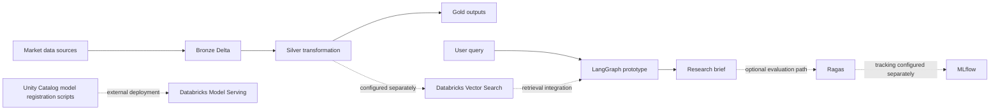

# Autonomous Market Intelligence Engine
<<<<<<< HEAD
=======
A production-oriented prototype / portfolio-grade reference architecture with many of the following production engineering patterns:
* Schema validation
* Retries
* Deterministic routing
* Observability
* Vector retrieval
* Guardrails
* Containerization
* CI/CD concepts
* Model registration
* Serving
* End-to-end testing

Designed to ingest, process, synthesize, and evaluate real-time financial and emerging market trends. Built on PySpark / Databricks Delta Lake for distributed data ingestion, LangGraph for cyclic agent orchestration, NeMo Guardrails for execution safety, and MLflow for automated evaluation.
>>>>>>> 2d17184bf1166bcf8762cd7e93b7039cc85255cf

An experimental portfolio project exploring market research workflows with Python, LangGraph, Databricks Vector Search, MLflow, and Ragas. The repository contains several architectural prototypes at different maturity levels. It is **not an enterprise production system**: deployment, security controls, automated recovery, monitoring, and benchmark reproducibility have not been demonstrated here.

## Current implementation

| Area | What is present in this checkout | Status / limitation |
|---|---|---|
| Agent workflow | `main.py` contains the richer retrieval, analysis, synthesis and routing prototype. `src/agents/graph.py` is a separate two-node graph with placeholder synthesis. | The agent implementations and state schemas are inconsistent; neither should be described as a verified production workflow. |
| Data | `Databricks_PySpark_ETL.py` and `notebooks/01_pyspark_etl.ipynb` demonstrate Bronze/Silver/Gold operations. | The Databricks job points to `src/etl/silver_ingestion.py`, which is absent. There is no runnable end-to-end local ingestion pipeline. |
| Vector Search | `src/indexers/vector_search_sync.py` uses `databricks.ai_search.client.AISearchClient`; `src/agents/retriever_node.py` uses `databricks_langchain.DatabricksVectorSearch`. | Requires a configured Databricks workspace and matching installed SDKs. Defaults are examples, not verified live resource names. |
| Guardrails | NeMo config, Colang flow, and a wrapper exist under `config/guardrails` and `src/utils`. | No evidence in this repository that guardrails are wired into the runtime agent or enforce PII masking. |
| Evaluation | `main.py` contains a Ragas evaluation path for faithfulness, answer relevancy, context precision, and context recall. | Requires compatible evaluator/model credentials and a real dataset. `src/evals/evaluate_run.py` delegates to that path. No reproducible scores or CI evaluation gate are established. |
| MLflow / serving | Model registration, endpoint deployment, and endpoint request scripts exist in `src/models`. | External Databricks/Unity Catalog setup is required. Serving requires an explicitly supplied registered model version. Endpoint existence and deployed behavior are not verified. |
| CI / tests | Unit tests are present in `tests/`. | No CI workflow is present. Test coverage and current pass status have not been established in this review. |

## Architecture intent

The intended design is a Medallion data pipeline feeding a retrieval-augmented agent, with evaluation and model lifecycle tracking. The diagram shows intended boundaries, not a claim that every connection is currently implemented.


```mermaid
flowchart LR
  A[Market data sources] --> B[Bronze Delta]
  B --> C[Silver transformation]
  C --> D[Gold outputs]
  C -. configured separately .-> E[Databricks Vector Search]
  F[User query] --> G[LangGraph prototype]
  E -. retrieval integration .-> G
  G --> H[Research brief]
  H -. optional evaluation path .-> I[Ragas]
  I -. tracking configured separately .-> J[MLflow]
  K[Unity Catalog model registration scripts] -. external deployment .-> L[Databricks Model Serving]
```

## Repository layout

```text
config/                 Agent and NeMo Guardrails configuration
data/                   Sample inputs and evaluation dataset
notebooks/              Databricks ETL exploration
src/agents/             Two competing agent workflow prototypes
src/evals/              Evaluation entry points
src/indexers/           Databricks Vector Search sync script
src/models/             MLflow registration and serving scripts
src/utils/              Guardrails wrapper
tests/                  Unit tests for prototype nodes and routing
main.py                 Main agent and Ragas evaluation implementation
Databricks_PySpark_ETL.py  Standalone ETL example
databricks.yml          Asset Bundle job configuration (references missing ETL file)
```

## Local setup

Python 3.11 or 3.12 is recommended by the dependency declarations. Some operations also require Databricks, Docker, and provider-specific credentials.

```powershell
py -3.12 -m venv .venv
.\.venv\Scripts\Activate.ps1
python -m pip install --upgrade pip
pip install -r requirements.txt
Copy-Item .env.example .env
```

Fill in only the credentials for the feature you intend to run. Never commit `.env` or access tokens. The tracked dependency file does not currently declare every optional import used by the repository (including the Databricks, NeMo, Ragas provider, and test packages), so a clean install may need additional dependency reconciliation before all modules can be imported.

### Run the agent prototype

```powershell
python main.py --help
```

<<<<<<< HEAD
The interface and provider requirements are defined in `main.py`. A successful local process does not establish that remote retrieval or model serving is available.

### Run tests

```powershell
python -m pytest
=======
This sample logs dynamically run executions to MLflow and formats a terminal status report:
>>>>>>> 2d17184bf1166bcf8762cd7e93b7039cc85255cf
```

Tests are currently based on prototype-specific state fields and mocked components. Passing them would not validate Databricks deployment, live retrieval, guardrail behavior, or the reported benchmark values.

### Run Ragas evaluation

```powershell
python -m src.evals.evaluate_run --dataset data/gold_eval_dataset.json --output-dir reports
```

The evaluator executes the query path and calls Ragas; it is not a deterministic local smoke test. Confirm model/provider configuration and schema compatibility before running. Evaluation should fail or report missing values when a metric cannot be computed; do not substitute static scores. Current historical values in `reports/eval_report_latest.csv` are not trustworthy: they contain constant metric columns and rows with an empty response and `No context retrieved.`

## Databricks resource configuration

The code currently defaults to these example identifiers:

| Resource | Default in code |
|---|---|
| Source table | `main.market_intelligence.silver_market_chunks` |
| Vector index | `main.market_intelligence.silver_market_chunks_vector_index` |
| Vector Search endpoint | `vs_market_intelligence_endpoint` |
| Registered model | `main.market_intelligence.market_agent_model` |
| Serving endpoint | `market_agent_serving_endpoint` |

These are not verified as existing resources. Set the corresponding variables in `.env` to values provisioned in your workspace. The `config/agent_config.yaml` names (`main.market_db.market_chunks_index`, `market_intelligence_vs_endpoint`) conflict with code defaults and are not currently consumed by the retriever implementation.

## Evaluation claims

The previously published Faithfulness `0.94` and Answer Relevance `0.93` claims are **withdrawn**. `src/evals/evaluate_run.py` previously assigned those constants without calculating metrics. `reports/eval_report_latest.csv` repeats those constants for each row, while its example response is empty and retrieval context is absent. `main.py` does contain a separate Ragas execution path, but no valid, reproducible output artifact was verified in this review.

The only metrics implemented in the dynamic Ragas path are Faithfulness, Answer Relevancy, Context Precision, and Context Recall. P95 latency is not calculated. There is no checked-in CI workflow or demonstrated 100-query PR gate. Treat all scores as unknown until a fresh run produces per-example results with valid inputs, provider details, dependency versions, and a retained run artifact.

## Security, reliability, and readiness

- Do not place personal access tokens in serving environment variables. Use Databricks-supported identity or secret mechanisms and least-privilege access for a real deployment.
- `.env` files are excluded from future version control, but `.env` and `.databricks/.databricks.env` are already tracked in this repository. Remove them from Git tracking and rotate any credentials present in repository history before publishing this project.
- The repository does not demonstrate automated deployment, least-privilege permissions, robust retries/recovery, production monitoring/alerting, or sustained benchmark results.
- Model registration and serving scripts are prototypes requiring workspace validation. The model version is supplied through `DATABRICKS_MODEL_VERSION`; the code does not prove that the served artifact is current or healthy.
- NeMo Guardrails configuration is not evidence of effective enforcement until it is integrated and tested against adversarial and policy test cases.

Describe this as an **experimental portfolio prototype**, not enterprise production-ready software.

## Engineering decisions and next steps

The project preserves the intended Databricks + Medallion + retrieval + LangGraph + evaluation direction, while keeping the implementation claims narrow. Before presenting this as an integrated system, consolidate the runtime around one state schema and graph; reconcile dependency pins and SDK imports; make the bundle target point to real files; define deterministic mocked unit tests and separate live integration checks; then produce a fresh, fully traceable evaluation run. Add CI, secret management, deployment rollback, monitoring, and failure-recovery evidence before making production-readiness claims.

## License
<<<<<<< HEAD

MIT. See [LICENSE](LICENSE).
=======
Distributed under the **MIT License**. See `LICENSE` for more information.
>>>>>>> 2d17184bf1166bcf8762cd7e93b7039cc85255cf
